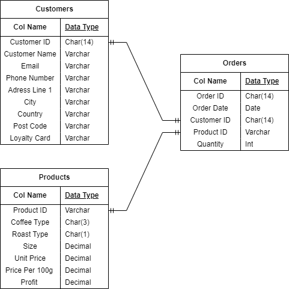
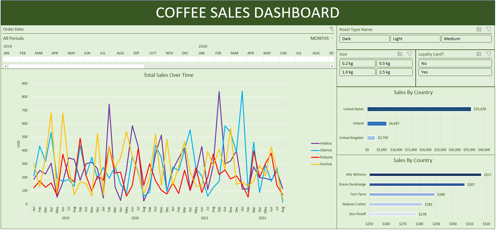

# Project Background

This project aims to use Excels data analysis and visulisation capabilities to create a comprehenisve dashoard that can provide actionable insights into the sales performance of an online coffee retailer. By analysing customer information, sales orders and product details, the dashboad will enable stakeholders to identify market trends, evaluate customer behabior and make data-driven desisions to optimise sales strategies and improve customer satisfaction. Dashboard can be accessed [here](https://github.com/adam-grove/Coffee-Sales-Dashboard-Excel/blob/main/CoffeeSalesDashboard.xlsx)

- **Sales Trends Analysis:** Helps identify patterns over time, enabling prediction of future sales and adjustment of strategies accordingly.
- **Sales By Country:** Provides insights into geographical performance, allowing for targeted marketing and expansion strategies in high-performing regions.
- **The 5 Highest Paying Customers:** Identifies key accounts, enabling focused customer retention efforts and personalized service to maintain these valuable relationships.
- **Ability to filter by time, roast, product size and loyalty card:** Allows for granular analysis, helping to understand specific factors influencing sales and customer preferences, which can inform product development and marketing strategies.

# Data Structure Overview

The downloaded data structure as seen below consists of three tables: orders, customers and products.

**Figure: Entity Relationship diagram of downloaded data**

---

# Executive Summary

**Overview of findings**
**Peak Sales Time Periods:**

- **Arabica:** September 2021
- **Liberica:** January 2022
- **Robusta:** September 2019
- **Excelsia:** June 2019

**Customer Demographics:**

- **Primary Market:** The United States represents the largest customer base across all coffee types.

**Loyalty Program Impact:**

- **Sales Boost:** Customers with loyalty cards consistently generate higher total sales compared to those without.
- **Dark Roast Popularity:** Dark roasts are the top-selling category among loyalty card holders, driving significant revenue.

**Regional Sales Performance:**

- **UK Absence:** No sales were recorded in the United Kingdom during 2022.

# Recommendations
### **Strengthen Loyalty Program**

- **Implement a tiered loyalty programme** with increasing rewards and benefits as customers climb through the tiers.
- **Offer exclusive discounts and early access to new products** to enhance the value proposition for loyalty card holders.
- **Leverage customer purchase data** to personalise recommendations and tailor offers to individual preferences.

### **Expand Market Reach**

- **Target regions with untapped potential** based on the regional sales performance analysis.
- **Increase advertising efforts** in targeted areas to raise brand awareness and drive customer acquisition.
- **Collaborate with local coffee shops and retailers** to expand distribution channels and reach new customers.

### **Optimise Product Offerings**

- **Highlight popular coffee types during peak seasons** to capitalize on seasonal trends and increase sales.
- **Use sales trend analysis** to identify new product opportunities and optimise inventory management.
- **Consider introducing limited-edition or seasonal blends** to create excitement and drive customer interest.

# Skills Developed
Excel Functions: XLOOKUP, IF, MATCH, VLOOKUP, Pivot Tables and Charts, Excel Dashboards, Sales Trend Analysis, Conditional Formatting 
